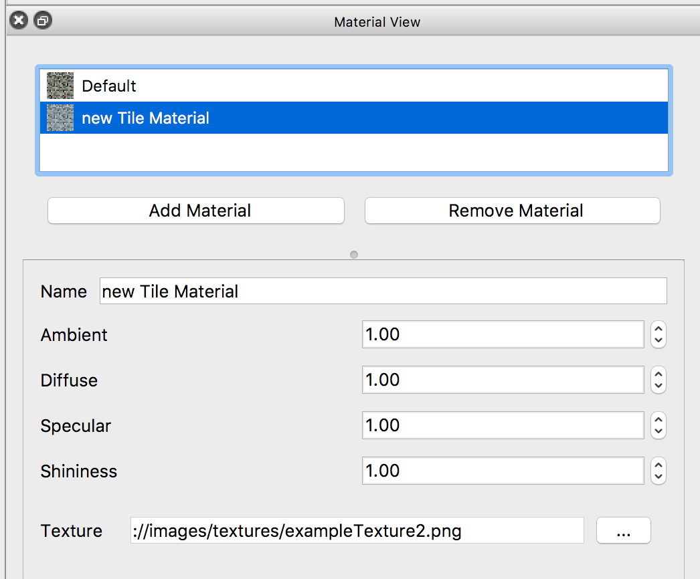
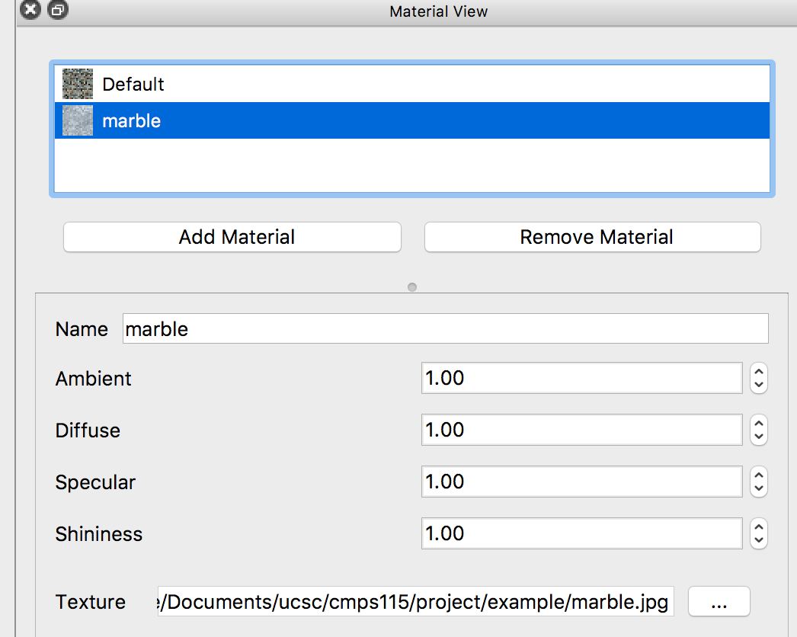
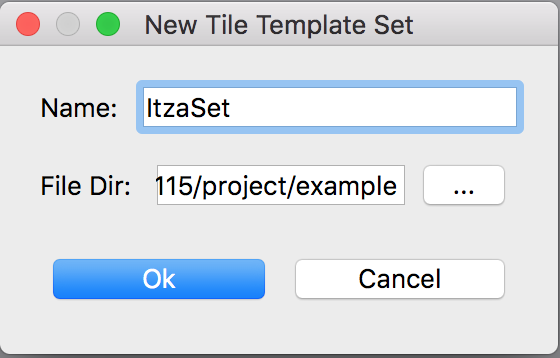
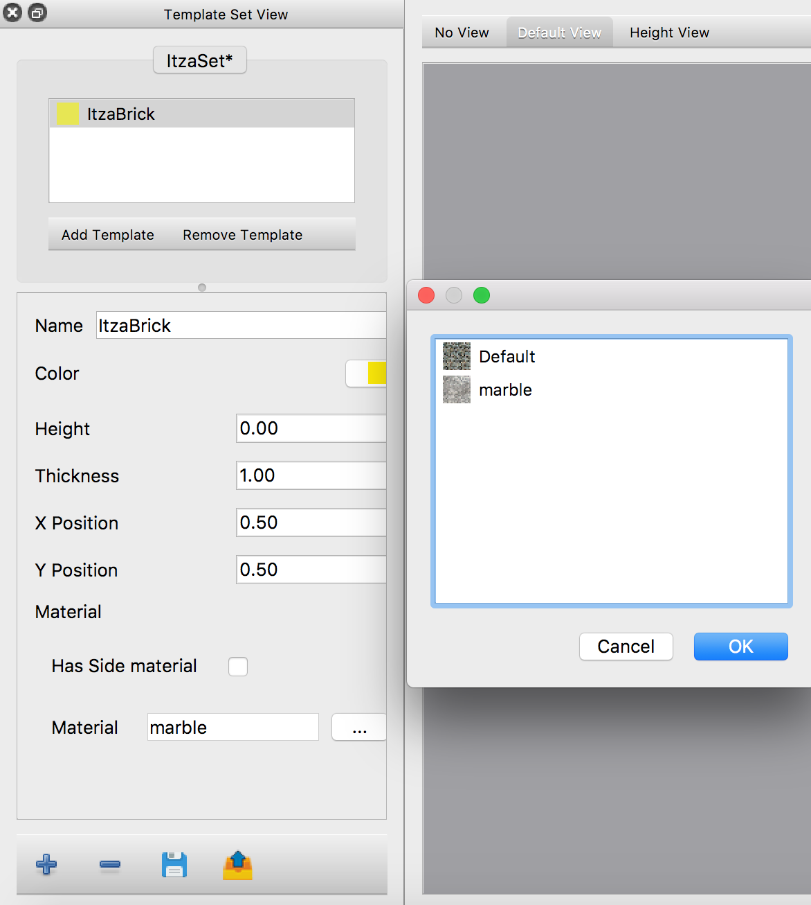
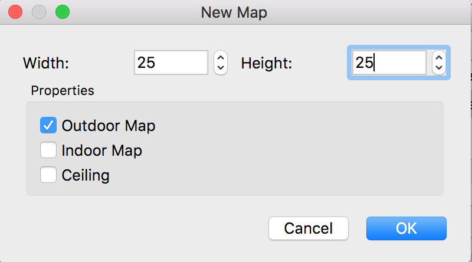
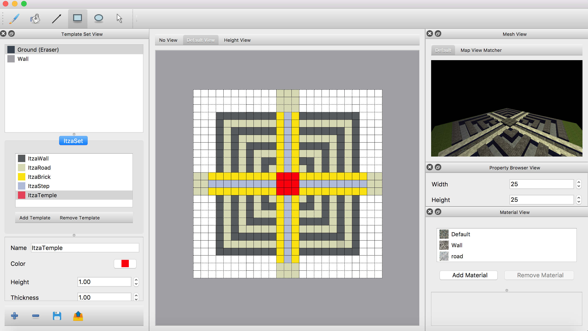
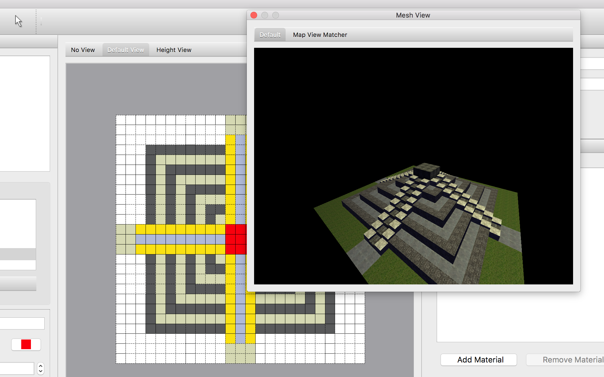
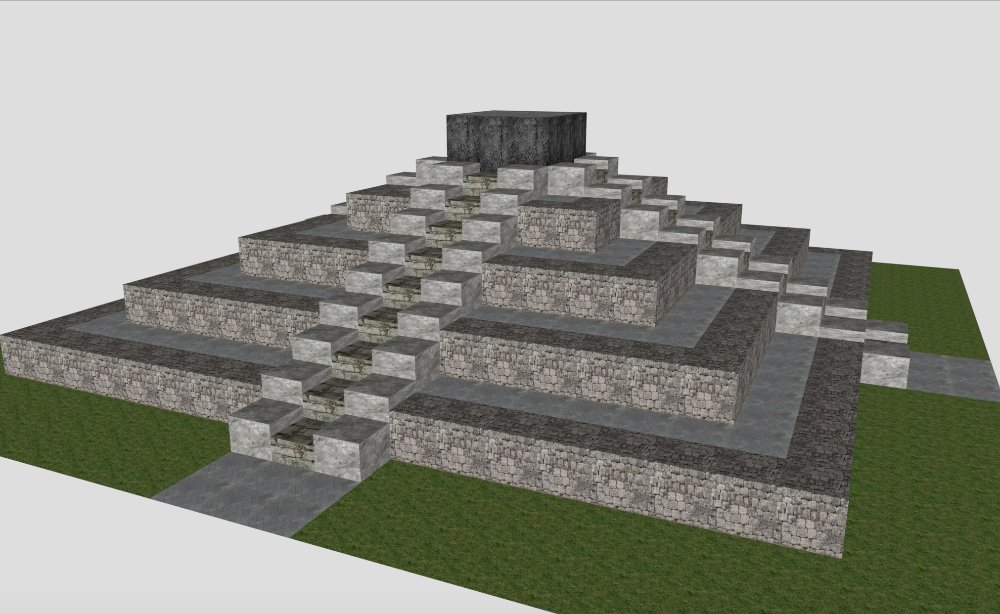

Examples
========

Chichen Itza
------------

This example will shows you how to create a coarse grain 3D model of Chichen Itza using our WallsAndHoles 3D map editor. A completed example can be found `here`_.

.. _here: https://github.com/Bdtrotte/3D-Map-Gen/releases

.. image:: images/Chichen\ Itza.png
   :align: center

*Chichen Itza*

First step, create materials. Add material by clicking the "Add Material" button in Material View, this action will create a default material named as "new Tile Material".

*Add Material*

Rename the material to "marble" and set its texture image to marble.png. 

*Making Marble Material*

After creating a material, next the create the Tile Template using this material. Push the |add| button in Template Set View to create a new tile template set. Set the name and path as follows, a tile template set named Itza will appears in Template Set View.

.. |add|	image:: images/add.png
			:width: 16
			:height: 16

Then push the |addTemplate| button to create a "New Tile Template". Rename it to ItzaBrick, set the color and associate it with the material we just created.  

.. |addTemplate|	image:: images/AddTemplateButton.png
					:width: 16
					:height: 16

*The created tile template set*

Then create a empty map using the shortcut ``Ctrl + N``, as follow:

*New Map Dialog*

Now you can draw the map with the tile template you just created. Draw a square at center of map, set the height of ItzaBrick to 2, a cuboid will appear in mesh view immediately.

.. image:: images/new_map.png
   :align: center

*A cuboid*

Repeat above step, create different materials for road, step, wall and temple (or just import the ItzaSet.wts provided in example). Draw the layout of Chichen Itza follow:

*A Flat Chichen Itza*

Change the height layout of map (height of tiles) to lift this "flat Chichen Itza" into layer shape pyramid. Select tiles using selection tool, the resulted map will be displayed in Mesh View like follow:

*Chichen Itza*

Finally, push ``Ctrl + E`` to export your completed map as .obj file. This is how the exported obj model looks like in Preview:

*Chichen Itza .obj*

