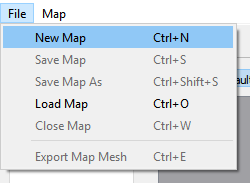
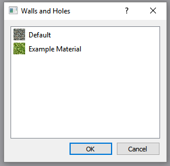

Introduction
============
Walls and Holes is a 2D map editor which lets you develop 3D maps for
your games. The primary feature for this application is the ease and 
speed of which you can create a map, and then at the end have a great mesh which 
can be exported for your own use.

Getting Started
================

Installing the program
----------------------
**Windows/Mac Installation:**
	* :download:`Windows installer v1.0 <downloads/WAH_1_0_Win64_installer.exe>`

	* :download:`Mac installer v1.0 <downloads/WallsAndHoles_1_0.dmg>`

To see the source code and files of the and the lastest release of the program go: `here`_.

.. _here: https://github.com/Bdtrotte/3D-Map-Gen/releases

Creating a New Map
------------------
When first opening the program you are greeted by the following window:

.. image:: images/MainWindow.png
   :align: center

*Main Window of the appilcation*

To create a new map go to: File→New Map ``Ctrl + N``

*Creating a new map*

The New Map dialog looks like this:

.. image:: images/NewMapDialog.png
   :align: center

*New Map Dialog*

Here we choose the initial size of the map, whether it's indoors or
outdoors, and whether if the map will have a ceiling or not. After 
creating the new map you will see a grid of empty sqaures, and now 
you can draw on the map. To draw on the map you must select a 
`Tool`_ and also a `Tile Template`_, there are two default Tile 
Templates provided, the *Wall*, and *Ground/Eraser*.

*Map is created*

Saving and Loading a Map
------------------------
To save the map go to: File→Save Map ``Ctrl + S`` and choose the directory which you
want the map to be saved in. 

*Saving a map*

Once the map is saved you may load the map into the program at anytime
you wish using File→Load Map ``Ctrl + O``, and choose the ``.wts`` file you want to
load into the program.

To export the map into a ``.obj`` file go to: File→Export Map Mesh ``Ctrl + E`` and
choose the file directory which you want the object file to be saved in.

.. _Tile Template:

The Tile Template System
========================

Overview
--------
The Tile Template system is for users to define different tiles 
which can output differing meshes.

Creating New Tile Template Sets
-------------------------------
Tile templates will be stored in Tile Template sets. To create a new 
Tile Template set press the |plus| button in the bottom left-hand corner 
of the screen, then you will be greeted by the following prompt:

.. |plus|	image:: images/add.png
			:width: 16
			:height: 16

.. image:: images/TiletempPrompt.png
   :align: center
  
*New Tile Template Set Prompt*

Enter the desired file directory which the Tile Template Set will be 
saved, it isrecommended that you save the Tile Template Set and the map 
files in the same directory.

Once that is done, a new window will pop up on the left-hand side of 
the screen in the Tile Set View

.. image:: images/ExampleTileTemp.png
   :align: center

Press the ``Add Template`` button and this will appear in the side toolbar:

.. image:: images/TileTemplate.png
   :align: center

You can modify the following properties of a Tile Template:
	* **Height:** Height of the tile
	* **Thickness:** How small or large the tile will be (max: 1.00)
	* **X Position:** The X position within the grid of the mesh
	* **Y Position:** The Y position within the grid of the mesh
	* **Material:** The material which the tile will use

**Example of changing the thickness**

.. image:: images/Thickness.png
   :align: center

*Left: Tile thickness of .25*

*Right: Tile thickness of 1.00*

Saving and Loading Tile Templates
---------------------------------
To save a Tile Template press the |save| button, and you will be 
prompted to choose the directory which the Tile Template will be saved in.

To load a Tile Template press the |load| button, and you will be 
prompted to choose the Tile Template which you want to use. 

.. _Tool:

Tools
======

Tile Map Tools
--------------

* **Brush Tool** |brush| ``B``
	- The Brush tool is the main tool which is used. Its radius can be 
	  adjusted using the spin box when the tool is selected.

* **Fill Tool** |fill| ``F``
	- The Fill tool is fills in an empty region

* **Line Tool** |line| ``L``
	- The Line tool creates a line, click and drag to use

* **Rect Tool** |rect| ``R``
	- The Rect tool is used to draw rectangles, click and drag to use

* **Ellipse Tool** |ellipse| ``E``
	- The ellipse tool draws ellipses, click and drag to use

* **Selection Tool** |select| ``S``
	- The selection tool is used to select tiles.
	- Single click to select one tile
	- Shift-Click to select multiple tiles
	- Double click to select tiles with same Tile Template which are touching
	- Triple click to select all of one Tile Template

.. |fill|	image:: images/fill.png
			:width: 16
			:height: 16

.. |select|	image:: images/mouse.png
			:width: 16
			:height: 16

Camera Tools
------------

*Mesh View Camera*

The *Default* camera tool is the used to explore your generated 3D mesh. To move the
camera around click inside the Mesh View and drag your mouse. To pan the camera 
``Shift-Click`` the Mesh View and drag your mouse. Use the mousewheel to zoom in
and out.

The *Mesh View Matcher* cameral tool matches the Tile Map and the mesh in a top-down
view.

Materials
=========
Every Tile Template can be assigned a custom material and texture.

Adding and Removing Materials
-----------------------------
To add a material press the ``Add Material`` button in the material view
window, after pressing the button this window will appear:

*Material View*

We are using the `Phong`_ reflection model for our shaders for the material

.. image:: images/phong.png
   :align: center

.. _Phong: https://en.wikipedia.org/wiki/Phong_reflection_model

`Source <https://en.wikipedia.org/wiki/Phong_reflection_model>`_

You can change the following properties of a material :
	* **Ambient:** Specifies the minimum brightness of a material
	* **Diffuse:** Diffuse determines the general color of a material when light shines on it
	* **Specular:** How bright the dots in the thrid image are
	* **Shininess:** How large the dots in the third image are
	* **Texture:** 
		- The texture of a material is an image specifying how a material looks.
		- To assign a texture click the ``...`` button and select the texture you wish to use.

Assigning Materials to Tile Templates
-------------------------------------
To assign materials to a Tile Template select the Tile Template which
you wish to assign a material to, and click on the ``...`` button

*Tile Template View*

This window will pop up:

*Choosing a Material*

Choose the material which you wish to use for the Tile Template

Keyboard Shortcuts
==================
**For Mac replace** ``Ctrl`` **with** ``Command``

* ``Ctrl + Mousewheel`` - Zoom in/out of the Tile Map
* ``Ctrl + N`` - Create a new map
* ``Ctrl + S`` - Save the map
* ``Ctrl + Shift + S`` - Save the map
* ``Ctrl + O`` - Load an existing map
* ``Ctrl + W`` - Close the map
* ``Ctrl + E`` - Export the map mesh
* ``Ctrl + Z`` - Undo last action
* ``Ctrl + Y`` - Redo last action
* ``B`` - Activate the Brush tool
* ``F`` - Activate the Fill tool
* ``L`` - Activate the Line tool
* ``R`` - Activate the Rect tool
* ``E`` - Activate the Ellipse tool
* ``S`` - Activate the Selection tool
